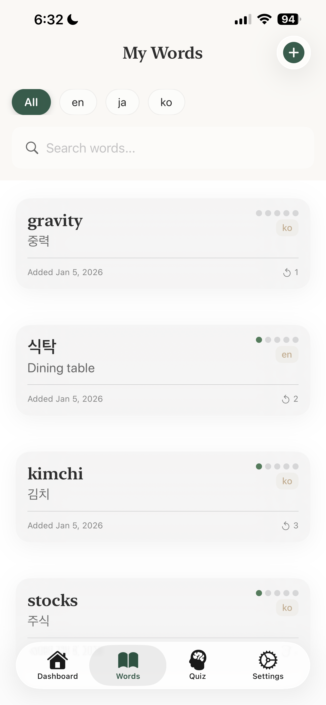

# LingoLog 🌿
### *A Personal Language Learning Companion for the Immersion-Based Learner*

LingoLog is a high-fidelity iOS application designed for intermediate language learners who prioritize immersion. Unlike flashcard apps that rely on pre-built decks, LingoLog empowers users to capture vocabulary from their daily lives—K-dramas, podcasts, or street signs—and master them using a scientifically-backed Spaced Repetition System (SRS).

---

## 📸 Demo & Aesthetics

  
  
  

| Dashboard | Add Word | Word List |
|:---------:|:--------:|:---------:|
| At-a-glance stats on your study streak and upcoming reviews | Real-time translation powered by Azure AI | Browse and manage your vocabulary collection |

---

## ✨ Key Features

### 🧠 Intelligent Spaced Repetition (SRS)
- **Mastery Calibration**: A 5-level system that tracks your familiarity with each word.
- **Dynamic Scheduling**: Review intervals expand as mastery increases (1, 3, 7, 14, 30 days), optimizing long-term retention.
- **Smart Quizzing**: The app dynamically filters "Due for Review" words, ensuring you only study what you're about to forget.

### 🌐 Context-Aware Learning
- **Real-time Translation**: Integrated with **Azure AI Translator** for instant, accurate lookups.
- **Context Tagging**: Users can record *where* they encountered a word (e.g., "In a restaurant menu in Seoul"), creating stronger mental associations.

### 💎 Premium User Experience
- **Glassmorphism Design**: A custom design system built in SwiftUI using vibrant gradients, blurs, and micro-animations.
- **Dynamic Dashboard**: At-a-glance stats on your study streak, word count, and upcoming reviews.

---

## 🛠 Technical Architecture

LingoLog is built with a focus on clean code and modern iOS best practices:

- **SwiftUI**: Utilizes a declarative UI approach with custom `ViewModifiers` for a consistent design system.
- **Core Data**: Local-first persistence handling complex queries for SRS scheduling and distinctive language filtering.
- **MVVM Architecture**: Ensures a clean separation between business logic, data management, and the view layer.
- **Service-Oriented Design**: Encapsulated network logic for Azure AI services, featuring secure API key management and robust error handling.

---

## 🚀 Challenges & Learnings

### 1. Complex State in SwiftUI
Handling real-time translation feedback while ensuring the UI remained responsive required deep dives into `@StateObject` and `@Published` patterns, specifically when managing the lifecycle of the `TranslationService`.

### 2. Spaced Repetition Logic in Core Data
Implementing a performant "Next Review Date" calculation directly within Core Data predicates allowed the app to remain snappy even as the vocabulary list grows into the thousands.

---

## ⚙️ Getting Started

1.  Clone the repository.
2.  Add your Azure Translator API Key to `Secrets.plist`.
3.  Open `LingoLog.xcodeproj` in Xcode 15+.
4.  Build and Run.

---

## 📬 Contact
**[Your Name]** - [Your LinkedIn] - [Your Website/Email]
